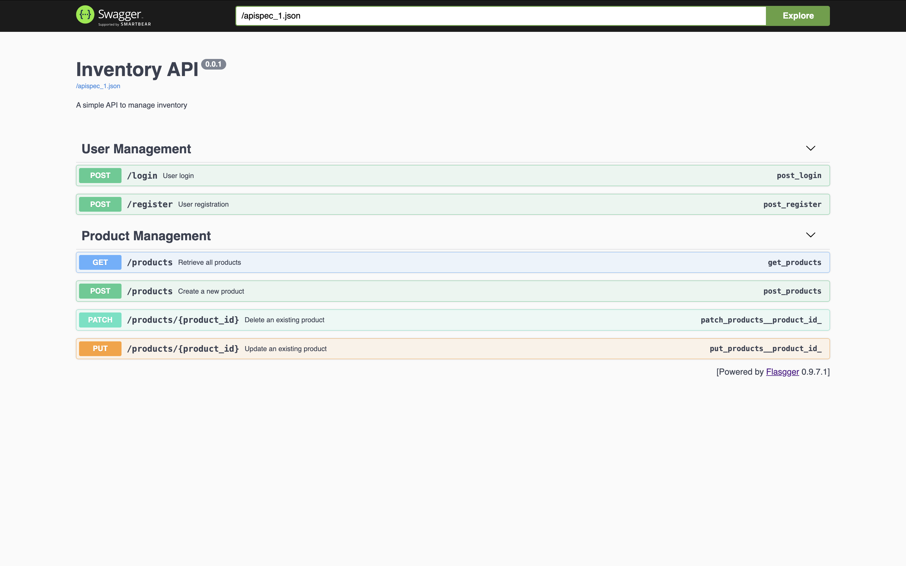

# Flask API Template with User Authentication and Product Management Endpoints

This is a template for a Flask API. It is a simple API that can be used as a starting point for a new project. Below is a high-level description of the application's functionality:

### Overview
The application is built using the Flask framework and includes endpoints for creating, updating, deleting, and retrieving products. It also includes user authentication endpoints for registering and logging in users. The application uses JWT (JSON Web Tokens) for securing the endpoints.

### Key Features
1. **User Authentication**:
   - **Register**: Allows new users to register by providing a username, password, and date of birth.
   - **Login**: Authenticates users and provides a JWT token for accessing protected endpoints.

2. **Product Management**:
   - **Create Product**: Allows authenticated users to create a new product by providing details such as name, amount, and expiry date.
   - **Update Product**: Allows authenticated users to update an existing product. Only the product owner or an admin can update the product.
   - **Delete Product**: Allows authenticated users to mark a product as destroyed. Only the product owner or an admin can delete the product.
   - **Get All Products**: Retrieves a list of products. Admin users can see all products, while regular users can only see their own products. The endpoint also supports filtering products based on their expiry status.

### Technologies Used
- **Python**: The primary programming language.
- **Flask**: The web framework used to build the API.
- **SQL**: Used for database operations.
- **JWT**: Used for securing the API endpoints.
- **Docker**: Used for containerizing the application.

### Endpoints
- **User Authentication**:
  - `POST /register`: Register a new user.
  - `POST /login`: Authenticate a user and return a JWT token.

- **Product Management**:
  - `POST /products`: Create a new product.
  - `PUT /products/<int:product_id>`: Update an existing product.
  - `PATCH /products/<int:product_id>`: Mark a product as destroyed.
  - `GET /products`: Retrieve a list of products, with optional filtering by expiry status.

### API Documentation

 - The API documentation is available at [http://localhost:5000/apidocs](http://localhost:5000/apidocs) after running the application.



### Security
- All product management endpoints are protected by JWT, ensuring that only authenticated users can access them.
- Role-based access control is implemented to ensure that only admins or product owners can update or delete products.

### Usage
- The application can be run locally using Docker. Instructions for setting up Docker and running the application are provided in the `README.md` file.
- An admin user is pre-configured for testing purposes, and the credentials are provided in the `README.md` file.

## Getting Started

These instructions will get you a copy of the project up and running on your local machine for development and testing purposes.

### Prerequisites

You will need to install Docker and Docker Compose on your local machine. Follow these steps:

1. **Install Docker:**
   - **macOS:**
     - Go to the [Docker Desktop](https://www.docker.com/products/docker-desktop) website.
     - Download the Docker Desktop for macOS.
     - Open the downloaded file and drag the Docker icon to the Applications folder.
     - Open Docker from the Applications folder and follow the installation instructions.
   - **Windows:**
     - Go to the [Docker Desktop](https://www.docker.com/products/docker-desktop) website.
     - Download the Docker Desktop for Windows.
     - Run the installer and follow the installation instructions.
   - **Linux:**
     - Follow the instructions on the [Docker Engine installation page](https://docs.docker.com/engine/install/#server).

2. **Install Docker Compose:**
   - Docker Compose is included with Docker Desktop for macOS and Windows.
   - **Linux:**
     - Follow the instructions on the [Docker Compose installation page](https://docs.docker.com/compose/install/).

3. **Verify Installation:**
   - Open a terminal and run the following commands to verify the installation:
     ```sh
     docker --version
     docker-compose --version
     ```


If the commands return the version numbers, Docker and Docker Compose are successfully installed.


### Installing

First, clone the repository to your local machine.

I have created a `.env.local` file for local development and an `.env.docker` file for the Docker build. You don't need to create them yourself.

To deploy the app on your Docker machine, navigate to the project directory open your terminal and run:

**Note:** Be careful if there is any container running on the same port.

```ssh
docker compose up --build -d
```

Now you are ready to test your application. I created an admin user for you. You can sign in by using the `/login` POST endpoint and use the following in the body:

```json
{
    "username":"admin",
    "password" : "Pass1234"
}
```
### Unit Tests

To run tests using `pytest`, follow these steps:

1. Install `pytest` if you haven't already:
    ```sh
    pip install pytest
    ```

2. Run the tests:
    ```sh
    pytest
    ```
   or for logging
    ```sh
    pytest -s
    ```

This will discover and run all the tests in your project.

### Postman collection and environment

I have created a Postman collection and environment for you to test the API. You can find them in the `postman` folder.

### Summary

You have successfully set up the Flask API template with user authentication and product management endpoints. You can now start building your application on top of this template.
